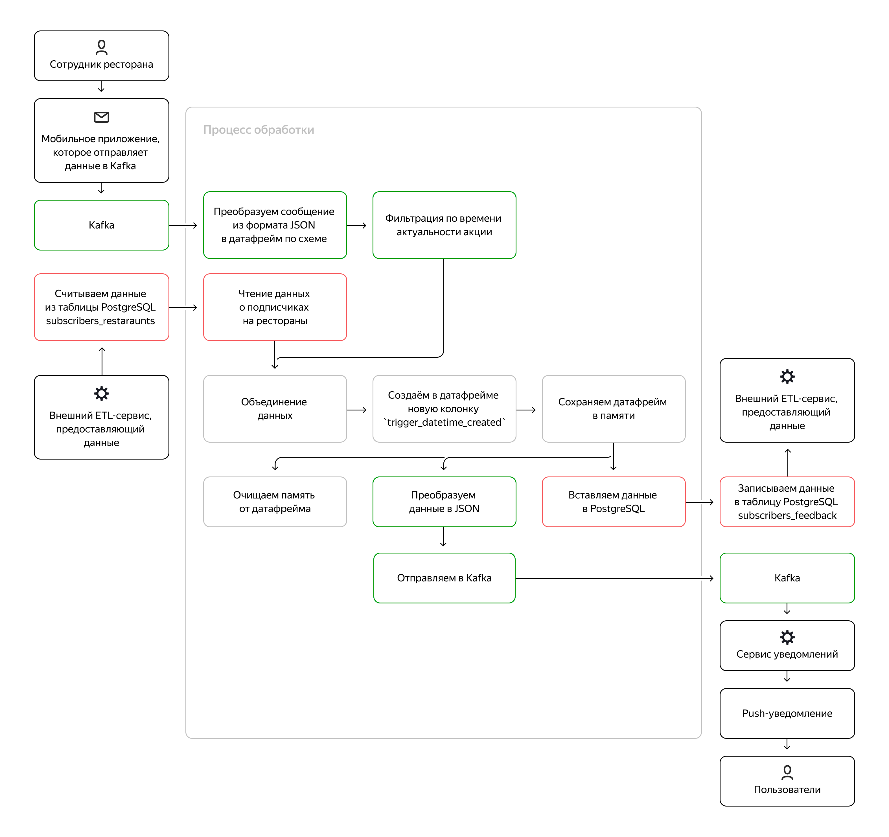

# Проект 8-го спринта

### Описание
Репозиторий содержит проект 8-го спринта.
Требуется подготовить сервис чтения данных о маркетинговых акциях из Kafka с помощью Spark Structured Streaming и Python 
в режиме реального времени и данных о подписчиках из PostgreSQL, который сохраняет объединненный результат в памяти и 
отправляет выходное сообщение для push-уведомлений в Kafka с информацией об акции, пользователе со списком избранного 
и ресторане, а также вставляет запись в Postgres, чтобы впоследствии получить фидбэк от пользователя.

### Схема сервиса

### Структура репозитория
Внутри src расположена папка scripts c файлом main.py и DDL.sql (для создания таблицы с фидбэком):

### Шаги/ход исследования
- Сформирована функция чтения данных об акциях из топика Kafka
- Написана функция чтения данных о клинетах из PostgreSQL
- Подготовлен обработчик каждого батча объединенных данных для отправки в топик Kafka и записи в PostgreSQL

### Инструменты
Kakfa, PostgreSQL, Pyspark, SparkStreaming

### Выводы
Сервис чтения и отправки данных подготовлен и успешно работает на данных, загружаемых и считываемых утилитой kcat
